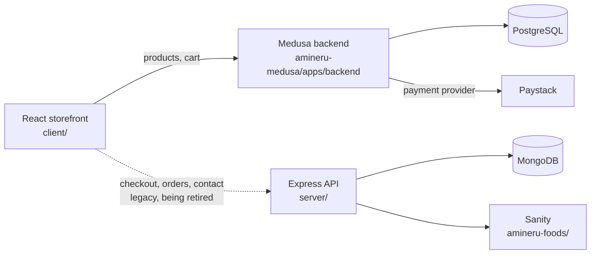

# Amineru Foods — E-commerce Platform

A storefront for **Amineru Foods**, a Nigerian food brand selling plantain flour, beans flour, garri, fufu flour, cassava starch and peppersoup spices. Customers browse products, fill a cart and pay with **Paystack** in Naira.

> **Status: mid-migration.** The backend is moving from a custom Express + MongoDB + Sanity stack to [Medusa](https://medusajs.com) v2. Products and the cart already run on Medusa; checkout, orders and admin still run on the legacy API. See the [roadmap](#roadmap).

## How it fits together



Solid lines are the target architecture. Dotted lines are legacy and will be removed once Medusa handles the full order flow.

## Tech stack

| Layer | Tools |
|---|---|
| Storefront | React 19, TypeScript, Vite, Tailwind CSS 4, React Router 7, Zustand, Framer Motion |
| Commerce backend | Medusa v2 (`@medusajs/js-sdk` on the client), PostgreSQL |
| Payments | Paystack (`medusa-payment-paystack` provider, NGN) |
| Legacy (being removed) | Express 5, MongoDB/Mongoose, Sanity |

## Repository layout

```
client/            React storefront (Vite)
amineru-medusa/    Medusa monorepo
  apps/backend/    Medusa server + admin dashboard
server/            LEGACY Express + MongoDB API
amineru-foods/     LEGACY Sanity Studio
```

## Getting started

### Prerequisites

- Node.js `^20.19.0` or `>=22.12.0`
- PostgreSQL running locally
- A [Paystack](https://paystack.com) account (test keys are fine)

### 1. Medusa backend

```bash
cd amineru-medusa
npm install

cd apps/backend
cp .env.example .env        # then fill in DATABASE_URL, secrets, PAYSTACK_SECRET_KEY
npx medusa db:migrate
npx medusa user -e you@example.com -p your-password   # creates your admin login
npm run dev                 # API on :9000, admin dashboard at :9000/app
```

Then, in the Medusa admin dashboard:

1. **Settings → Regions:** create a region that uses the **NGN** currency. The storefront looks it up by currency code and throws if it isn't found.
2. **Settings → Publishable API Keys:** copy the key and link it to your sales channel. You'll need it for the storefront.

### 2. Add products

In the Medusa admin dashboard, go to **Products** and create your products with an NGN price. Set the price as the plain Naira amount (₦5,000 is entered as `5000`), since Medusa stores prices in whole currency units.

### 3. Storefront

```bash
cd client
cp .env.example .env        # add the Medusa URL, publishable key and Paystack public key
npm install
npm run dev                 # http://localhost:5173
```

### 4. Legacy API (optional)

Only needed while checkout and orders still run on Express.

```bash
cd server
cp .env.example .env
npm install
npm run dev                 # http://localhost:3000
```

## Environment variables

Real values live in `.env` files, which are git-ignored. Each app ships a `.env.example` template listing what it needs.

| File | Purpose |
|---|---|
| `client/.env` | Medusa URL and publishable key, Paystack **public** key, legacy API URL |
| `amineru-medusa/apps/backend/.env` | Database URL, CORS origins, JWT/cookie secrets, Paystack **secret** key |
| `server/.env` | Legacy API: Mongo URI, JWT secret, Paystack secret, Sanity token |

Only `VITE_`-prefixed variables reach the browser, so secret keys never go in `client/.env`.

## Roadmap

- [x] Medusa backend with the Paystack payment provider configured
- [x] Products created in Medusa (8 items)
- [x] Storefront product listing and detail pages read from Medusa
- [x] Medusa-backed cart with optimistic updates
- [ ] Checkout on Medusa (cart → payment session → order) instead of the Express `/orders` route
- [ ] Paystack payment through the Medusa provider, replacing the custom webhook
- [ ] Order status and lookup pages on Medusa
- [ ] Replace the custom admin panels with the Medusa admin dashboard
- [ ] Decide where the contact form goes (currently the Express API)
- [ ] Remove `server/` and `amineru-foods/`
- [ ] Automated tests and CI

## Scripts

| Where | Command | What it does |
|---|---|---|
| `client/` | `npm run dev` | Start the Vite dev server |
| `client/` | `npm run build` | Type-check and build for production |
| `client/` | `npm run lint` | Run ESLint |
| `amineru-medusa/apps/backend/` | `npm run dev` | Start Medusa in development |
| `amineru-medusa/apps/backend/` | `npm run build` | Build the Medusa backend |